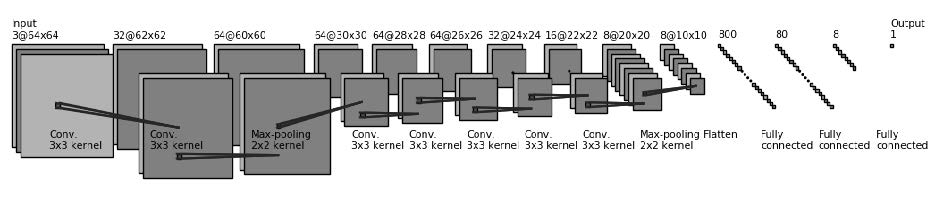

## ISONet

## ISONet: ISO Setting Estimation Based on Convolutional Neural Network and Its Application in Image Forensics 

### 摘要
The ISO setting, which is also known as film speed, determines the noise characteristics of the output images. As a consequence, it plays an im-portant role in noise based forensics. However, the ISO setting information from the image metadata may be unavailable in practice. Hence, estimating the ISO setting of a probe image from its content is of forensic significance. In this work, we propose a convolutional neural network, which is called ISONet, for ISO set-ting estimation purpose. The proposed ISONet can successfully infer the ISO setting both globally (image-level) and locally (patch-level). It is not only work on uncompressed images, but also effective on JPEG compressed images. We apply the ISONet into two typical forensic scenarios, one is the image splicing localization and the other is the Photo Response Non-Uniformity (PRNU) corre-lation prediction. A series of experiments show that the ISONet can yield a re-markable improvement in both forensic scenarios.

### 网络结构

### 依赖需求
为了运行测试demo,你需要安装以下依赖(所有依赖使用最新版本即可)
- pytorch >=1.3
- opencv-python 
- matplotlib
- h5py
- numpy
- tensorboard

### 测试 ISONet 模型

#### 测试TIF模型

运行`python test_model.py --model_path models/net_tif.pth --pic_path 测试图片的路径  `

#### 测试JPEG模型
运行`python test_model.py --model_path models/net_jpg.pth --pic_path 测试图片的路径 `

### 训练 ISONet 模型
这里以训练TIF模型为例

1. 下载训练集图像

2. 运行`prepare_data.py`生成训练数据集

   `python prepare_data.py --aug_times 3 --pic_type tif --data_path TIF文件夹路径 --save_path 保存的文件夹路径`

3. 运行`main_train.py`训练模型
4. `python main_train.py --data_path 保存的H5数据文件夹路径`